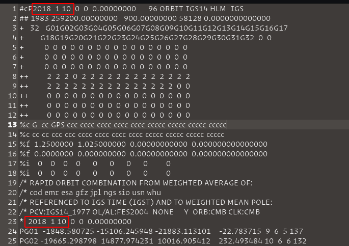
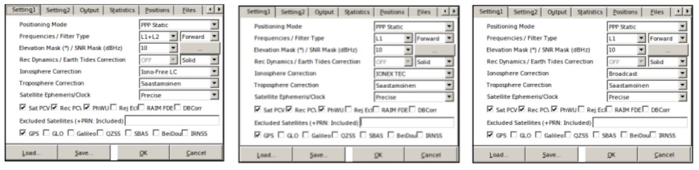

# Guide for post-processing analysis in single frequency GNSS receivers (L1).

> Victor Dallagnol Bento
> 
> Instituto Nacional de Pesquisas Espaciais - INPE 
> 
> Universidade Federal de Santa Maria - UFSM

## 1. Concepts
Post-processing is a positioning method that collects data from receivers simultaneously. The main difference between post-processing and real-time processing is that positioning data is not provided in real time, making it necessary to use a RINEX file (Receiver Independent Exchange Format) to process it. The RINEX format is a data exchange format for raw data from satellite positioning stations that allows the user to post-process the data received to produce a more accurate result.

For a post-processing analysis, the RTKPost software was used, which is available on [RTKLib](http://www.rtklib.com/). [RTKLib](http://www.rtklib.com/) is an open source software package for standard and accurate positioning with GNSS (Global Satellite Navigation System). [RTKLib](http://www.rtklib.com/) consists of a library of portable programs and several APs (application programs) that have many and individuals characteristics.

There are two types of applications present in [RTKLib](http://www.rtklib.com/). 
- *GUI (Graphical User Interface)*: is a graphical user interface that interacts with applications, having images, icons and elements that facilitate navigation and use;
- *CUI (User Character Interface)*: the user has to interact with the applications through commands. 

Despite having a more complicated navigation and operation than GUI applications, CUI applications have better results, as well as the possibility of *parallel executions* with greater ease.

## 2. Install
The instalation ocoures in a Linux Kernel system, the Elementary OS 5.0, based on Ubuntu 18.04.2LTS. For the analysis was used the [RTKLib](http://www.rtklib.com/) in version 2.43 b33 (August, 2019). In the [RTKLib](http://www.rtklib.com/)  we have the possibility to download two options of files, the files with contain the GUI  applications (windows systems or wine on linux) and another file with the binary codes of all applications. The following command was used for the instalation of [RTKLib](http://www.rtklib.com/)  in Elementary OS 5.0:

` sudo apt install rtklib`

## 3. Obtaining the files

RKLib has two similar applications for post-processing analysis, *RTKPost * and *RNX2RTKP*. The *RTKpost * is a graphical application (GUI) and focuses on Windows systems and *RNX2RTKP* is similar to *RTKPost* but only works on the console (command lines) with some advantages compared to its brother (*RTKPost* ). Both applications need some files, such as RINEX (observation and organization), and definitions of the positioning system that will be analyzed (GPS, GLONASS, Galileo and BeiDou).

To search for the files on the IGS website, it was necessary to obtain the Julian day and week gps of the days chosen for the simulation ([LABSat](https://www.labsat.co.uk/index.php/en/gps-time-calculator)). The files needed to execute the RTKPost / RNX2RTKP are available on the IGS website with a direct link to NASA's [CDDIS](https://cddis.nasa.gov/) (The Crustal Dynamics Data Information System). The files required for the corrections are: Observation RINEX, Navigation RINEX, Antenna, IONEX (when necessary), Clock Corrections and Satellite Orbit.

Simulated days:

| Date       | Julian | GPS Week |
| ---------- | ------ | -------- |
| 10.01.2018 | 010    | 1983     |
| 10.02.2018 | 041    | 1987     |
| 10.03.2018 | 069    | 1991     |
| 10.04.2018 | 100    | 1996     |
| 10.05.2018 | 130    | 2000     |
| 10.06.2018 | 161    | 2005     |
| 10.07.2018 | 191    | 2009     |
| 10.08.2018 | 222    | 2013     |
| 10.09.2018 | 253    | 2018     |
| 10.10.2018 | 283    | 2022     |
| 10.11.2018 | 314    | 2026     |
| 10.12.2018 | 344    | 2031     |
About the files:
- *Satellite Orbit (.sp3)*: these files are important because the movement of the satellite rotating around the Earth has a force associated with it that pushes it away from the Earth. For each orbit, there is a speed at which gravity and centrifugal force balance each other and the satellite remains in a stable orbit. It is necessary to check each file to see if the file corresponds to the day that will be simulated, as shown in the figure below. The chosen files that contained the days chosen for the simulation were the IGR files (fast orbits) and can be accessed at ftp://cddis.gsfc.nasa.gov/gnss/products/ `Week (GPS)`.

- *Clock Corrections (.clk)*: after downloading the files from the Orbits, the clock file is downloaded from the same site, similar to the Orbits file, changing only the extension from .sp3 to .clk. The clock correction files contain solutions for clock synchronization errors, referring to the GNSS time scale (GPS, GLONASS, Galileo and others). A list with names of stations around the world that use Clock Correction is contained in the .clk file. The stations were filtered based on the information contained in the clock files, leaving only the stations available with the files.
- *Observation Rinex (.YYo)*: the files for all stations found in the Clock Correction files (.clk) have been downloaded (100 stations selected). The RINEX format consists of a text file for observation data, navigation message and meteorological data, referring to a specific day and receiving station, containing a header for general information and a data section. The data section includes the pseudo-distances of code (meters), phase (entire cycles) and observation time (GPS time) recorded according to the receiver's clock. The Observations RINEX download link is ftp://cddis.gsfc.nasa.gov/gnss/data/daily/`YYYY`/`DDD`/`YY`/ where YYYY and YY are representations of the year and DDD of the Julian day.
- *Navigation RINEX (.YYn) (broadcast ephemerides - broadcast)*: the Navigation RINEX files or Broadcast Ephemerides (Transmission Ephemerides) contain position, speed and clock information for all satellites in the GPS constellation for each day. RINEX contains all necessary transmission messages for post-processing. The broadcast events can be accessed at ftp://cddis.gsfc.nasa.gov/gnss/data/daily/`YYYY`/`DDD`/`YYn`/`brdcDDD0.YYn.Z`.
- *Antenna (.atx)*: the files for antenna calibration for the global satellite navigation system (GNSS) are in the ANTEX format (.atx) and are aimed at absolute phase center corrections (PCVs). The phase center is defined as the apparent source of radiation depending on the elevation angle, azimuth and frequency of the signal. The name of the Antenna Correction file used for post-processing analysis for a specific day can be found in the clock file (.clk) and these antenna files can be found at: ftp://ftp.igs.org/pub/station/general/pcv_archive/ . The correct file to be used can be found in the clock (.clk) file.

- *IONEX - TEC Maps (.YYi)*: IONEX files contain maps of the total vertical electron content of the ionosphere (VTEC) and daily polarization values of the GNSS satellite differential code (DCB) derived from the dual frequency GNSS data. These maps are generated daily and IONEX files generated by INPE's ionospheric simulation, which is based on the SUPIM-DAVS model and by the IGS, which is based on the model combination (GIM), can be accessed at: ftp: // cddis.gsfc.nasa.gov/gnss/products/ionex/`YYYY`/`DDD`/`igsgDDD0.YYi.Z`.

## 3. Configuration

RTKPost and RNX2RTKP use the same files from the previous step to make their settings. Because they have many options and several combinations for post-processing analysis, at first it was decided to make the settings in the RTKPost application, as it has a graphical interface (GUI) with greater intuitiveness, favoring understanding.
Three configurations were analyzed in order to evaluate ionospheric corrections in single frequency GPS receivers compared to ionospheric corrections in dual frequency receivers. Configuration sets were used for ion-free (double frequency), Broadcast (Klobuchar model) and IONEX TEC (SUPIM-DAVS and GIM models) corrections.

The RTK-Post configurations are separated by tabs, each with its specific function. The figure below shows the settings used for the three Double Frequency correction methods (left), IONEX file (center), and Klobuchar (right)

The Setting1 tab is one of the most important of the configurations, being able to define the number of frequencies, the positioning mode, the elevation mask, SNR (Signal-to-Noise Ratio), ionospheric, tropospheric and terrestrial tidal corrections, the GNSS navigation system, among other configurations. The settings used to assess the corrections were:

- *Positioning Mode*: The GNSS receivers have different modes of positioning and navigation, where each mode has its degree of complexity, precision and accuracy. PPP (Precise Point Positioning) is an evolution of the single point positioning mode (SPP), it has the characteristic of estimating satellite orbits and clocks through a network of reference GNSS stations distributed across the globe, but only one single station is processed at a time. The main difference between static (static) and kinematic (kinematic) mode is that in the first the coordinates are adjusted for the entire observation interval, while in the second the adjustment is by season.
- *Frequencies / Filter Type*: Single frequency (L1) are used for GPS systems with only one frequency and double frequency (L1 + L2) for GPS systems with double frequency. The filter in forward mode, the observation data is processed starting at the beginning of the data and continuing until the end.
- *Elevation Mask / SNR Mask*: Satellites will be excluded if they are below a certain elevation angle or with a low signal to noise ratio (SNR).
- *Rec Dynamics / Earth Tides Correction*: The Dynamic Rec is only switched on when using a Rover (space exploration vehicle), in which case this dynamic positioning has been switched off. The Earth's tide is a phenomenon of the deformation of the Earth's elastic body caused by the gravitational pull of the Moon and the Sun. The effects caused by terrestrial tides are not crucial for relative positioning, however, using the PPP positioning mode all the sources of errors must be considered as the positioning method tries to determine the absolute position of a point with a single GPS receiver. The standard model for solid land tides is the IERS92.
- *Ionosphere Correction*: RTKLib's post-processing analysis software offers many ionospheric correction options. The ones used in this work are the Iono-Free LC correction, for dual frequency receivers (ion-
free); Broadcast, for simple frequency receivers using the Klobuchar model; IONEX TEC, also for single frequency receivers but using IONEX files (VTEC maps).
- *Troposphere Correction*: The tropospheric delay depends on the signal path through the neutral atmosphere and, therefore, can be modeled according to the satellite's elevation angle. Due to the differences between the atmospheric profiles of dry gases and water vapor, it is better to use different mappings for dry and wet components. The Saastamoinen model is an option in many GPS software packages and is considered the most accurate hydrostatic model. The dry atmosphere can be modeled from the pressure and temperature of the surface using the ideal gas laws. The wet component is more unpredictable and difficult to model; therefore, for high precision positioning, this delay is estimated together with the coordinates.
- *Satellite Ephemeris / Clock*: The use of the precise point positioning mode (PPP) makes us highly dependent on the use of precise ephemeris (Precise option) and the clock products used by the satellites. The Precise mode used in ephemeris and clock has the function of making a more accurate calculation of the real satellite orbits, obtained using data collected in tracking stations around the world.
- *Sat PCV*: Defined to be able to use Antenna file.
- *Rec PCV*: Defined to be able to use Antenna file.
- *PhWindup*: Defined if the phase completion correction for PPP modes is applied or not.
- *Navigation System*: Section to define the GNSS navigation system. The analysis system used in this work was the GPS.

On the Setting2 tab, the Integer Ambiguity Resolution (GPS) option was turned off, disabling ambiguous entire resolution strategies for GPS. GPS positioning at the centimeter accuracy level is based on the measurement of the carrier wave phase, which makes the observable ambiguous of an entire number of cycles between the satellite and receiver antennas at the time of the first observation, called GPS ambiguity. The Outputs tab contains the output settings for the file generated from post-processing (.pos). It was defined that the output files would have the coordinates in the XYZ-ECEF format ("conventional terrestrial" system or centered on the earth) with time in UTC format of three decimal places to enable error estimation
based on the calculation of the Euclidean distance to the (known) locations for the GNSS stations used.

In the Positions tab, the option to use an antenna file, Antenna Type, was selected in option *. Another very important configuration is the Files option, where the antenna files (.atx) and the IONEX file are loaded (when IONEX TEC ionospheric correction mode is selected). The other tabs and settings have not changed.

To run the post-processing software with ionospheric correction based on IONEX TEC we need the files in the IONEX format generated by the ionospheric simulation of INPE, based on the SUPIM-DAVS model, and by the ionospheric simulation of the IGS, based on the GIM model. IGS IONEX files can be downloaded from the IGS website described in Step 2: Obtaining the files. The IONEX from the ionospheric simulation of INPE needed to be generated through simulation that takes place through command lines using a cluster of computers. Having obtained all the files necessary for the post-processing of the chosen days and having performed the RTKPost configuration, it was decided to use the RNX2RTKP software.

Although RTKPost has a graphical interface and is more intuitive for the user, its execution would end up being hampered by the number of stations and files to be manipulated. RNX2RTKP is a version of RTKPost without a graphical interface, and although it also runs one observation file at a time, it is easier to automate operations because the command line is used. In addition, the RNX2RTKP is able to execute configuration files exported from RTKPost using the Save button. After configuring RTKPost in Step 3 - Software configuration for the three forms of correction (ion-free, Klobuchar and IONEX), the settings were saved in text files with the extension ".conf". Because RNX2RTKP can use pre-configured RTKPost files in its execution, four scripts were created, one for each correction method, in order to optimize the execution.

The script entries are the Julian day, the configuration files and other necessary files mentioned above. A function for mapping directories has been created, so the program maps the directory containing the observation files and stores their names in a list. Each line of the list contains the name of an observation file for each station, which is used in a loop in order to cycle through the entire list, and invokes the RNX2RTKP program by varying its parameters.
Note. The output file receives the same name as the observation file, changing its type to ".pos". A directory is generated by each script, with each directory containing 100 post-processing files, referring to the observation file of each station. In total, using the four correction methods (double frequency, Klobuchar, IONEX SUPIM-DAVS, IONEX GIM) there will be four files, with different corrections, referring to a single selected station.

> for more information see the [REFERENCE](./reference/TCC%20-%20Victor%20Dallagnol%20Bento.pdf).
